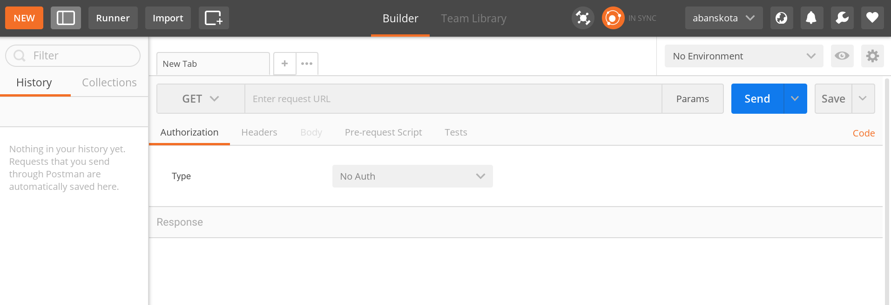
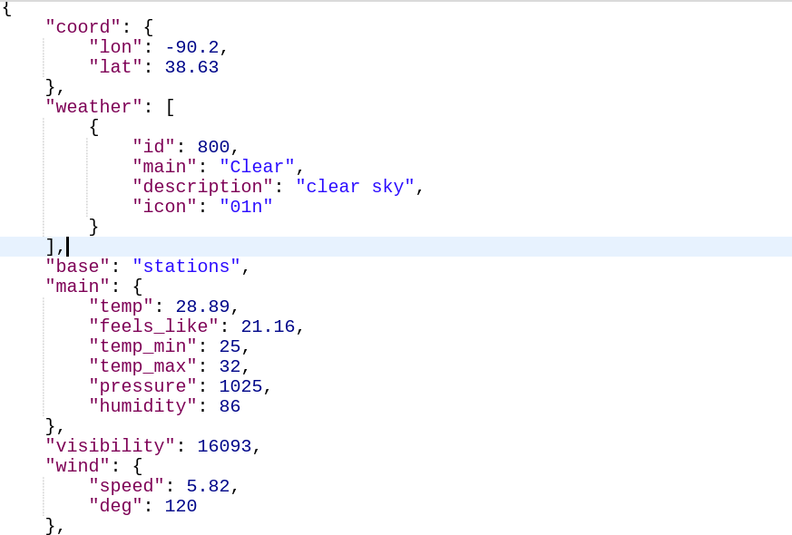

## An intro to postman for data scientists

### create a simple request for any available open-source API and see the various components of the request and response received when the request is executed using the Postman application.

Postman is a tool used by developers to test RESTful APIs they build. For data scientists, it provides a simple graphical interface to interact with an API and test its functionality without worrying too much about correctly formatting the http requests. Once an API call is tested by sending HTTP requests and retrieving data successfully in Postman, it gets much easier to implement the same in python to retrieve data in an automated manner.

Install Postman

Postman can be installed in your computer in two ways:

1. As an app in Google Chrome browser (This has already been deprecated)

2. It can also be installed as a desktop application. It supports both windows and Mac OS.

Go to this [link](https://www.postman.com/downloads/) and download the version suitable for your OS platform and install it in your computer following the straightforward instructions. When you open the installed application, it should look like the below screenshot.

As seen in the above screenshot, `GET` is the default HTTP method in the Postman. All other fields are currently empty, some of which need to be populated to make a request to an API. For this tutorial, we will try to send requests to an open source API by [OpenWeather](https://openweathermap.org/) to retrieve the current weather of a given city or locations (geographical coordinates). For that, one needs to create an account by signing up [here](https://home.openweathermap.org/users/sign_in).

Once you register, an `AAPID` will be emailed back to you. Follow the following steps to setup a global environment variable for the `AAPID`.

- Copy the `AAPID` value from your email.
- Click on the `eye` icon (`Environment quick look`) on the top right of the interface.
- Click on the `Edit` tab for `Global`
- Write `AAPID` into `key` and paste the thing that you copied from your email into `value` 
- CLick save and close

In order to make a request to the weathermap API, you need to provide the endpoint URL for the resource you are requesting. Most APIs have a document that describes how to construct such URLs. Basically, APIs have a base URL to which the other endpoint paths are appended. The base URL for the weathermap API for the `version 2.5` is `api.openweathermap.org/data/2.5/weather?`. Enter the base URL in the URL section and then click on the `Params` tab and add values to `Key` and `Value` as shown in the following screenshot.
    

Once you enter those keys and values, you can see that those values have been appended to the base URL. The double curly brackets tells Postman to go and get the value from the Global variables you set in the previous step. You could have just typed your `AAPID` value there, but with this setup you don't need to type the value multiple times for different requests, and it also helps your `AAPID` to be invisible to others.

So we are all set to send the `GET` request to the API. With that request, we are asking the API to send us back the current weather information for `Saint Louis`. Once you hit the `Send` button, you should retrieve the similar result like below.

On top of the returned body, you can see that the `status` was `200 ok` and the response `time` was 168 ms. The information was returned in the`JSON` format. `JSON` stands for JavaScript Object Notation, a lightweight format for storing and transporting data. The format is very similar to python dictionary represented as key and values. The API has a `mode` parameter to specify whether to return values in `JSON` , `XML`, or `HTML`. If the mode parameter is empty, the response body format is `JSON` by default.

You might have noticed that the temperature has a higher value than what we are used to seeing in Saint Louis or for any other parts of the world for that matter. Actually, the default unit for the returned temperature value is `Kelvin`. In order to get the value in `fahrenheit`, we need to pass another parameter as below. Again, one needs to look into API documents for such information.

If you send the above request, you will get the response like below in Fahrenheit.

The openweathermap API doesn't allow more than 60 API calls per minute for non-commercial application (free-of-charge). This is called rate limit and most APIs serving free data apply that concept. The openweathermap api also allows you retrieve weather information of multiple cities as well as historical weather data. In order to retrieve data for multiple cities in a single call, you can format the endpoint with bounding box geographical coordinates as below.

When the returned response contains a large number of counts, the utility of Postman to analyze information gets diminished. We will show in the next section how python can be used to retrieve and parse such large responses. But before writing code in Python, it is always advisable to have a very good feel for API by testing requests with Postman in conjunction with following API document. This tutorial only showed a simplified `GET` API call. Some API calls get pretty cumbersome and might need filling out more  information  such as `Header`, `Authorizations` depending upon their setup. In all cases, Postman is your best friend to get to know with a new API and testing out their endpoints.

